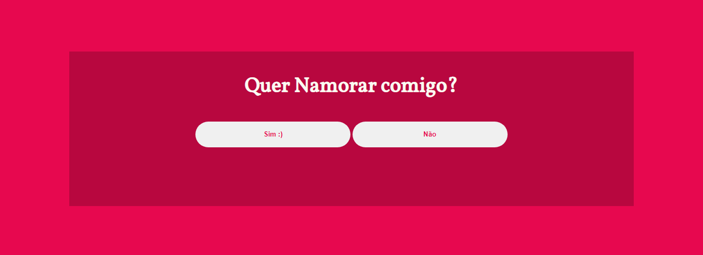
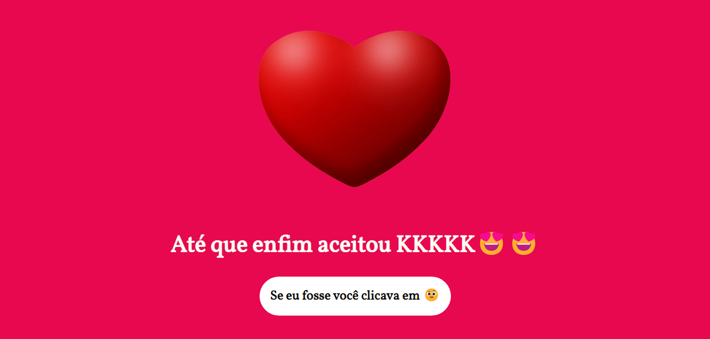

# Quer Namorar Comigo?

> Projeto inspirado no repositório do @professorlucianoz porém utilizando Javascript..

### Ajustes e melhorias

O projeto ainda está em desenvolvimento e as próximas atualizações serão voltadas nas seguintes tarefas:

- [x] Criado tela de inicio
- [x] Criado botões e animações
- [x] Adicionado funções de criação e remoção de elementos
- [x] Criação da tela de decisão
- [x] Criação animações e outros detalhes
- [x] Adicionar musica na tela de decisão
- [ ] Adicionar responsividade

## 💻 Tecnologias

### Esse projeto foi desenvolvido com as seguintes tecnologias:
- Html
- Css
- Javascript

## 💾 Screenshots

Tela de Escolha:

Tela de Decisão:

## 📫 Contribuindo para  este repositório

Para contribuir com o projeto, siga estas etapas:

1. Bifurque este repositório.
2. Crie um branch: `git checkout -b <nome_branch>`.
3. Faça suas alterações e confirme-as: `git commit -m '<mensagem_commit>'`
4. Faça push para a sua branch: `git push origin minha-feature`
5. Crie a solicitação de pull.

Como alternativa, consulte a documentação do GitHub em [como criar uma solicitação pull](https://help.github.com/en/github/collaborating-with-issues-and-pull-requests/creating-a-pull-request).

## 💙 Autor

<table>
  <tr>
    <td align="center">
      <a href="#">
         
        
          <b>Walyson Assis</b>
        
      </a>
    </td>
  </tr>
</table>

## 📝 Licença

Esse projeto está sob licença. Veja o arquivo [LICENÇA](LICENSE) para mais detalhes.

[⬆ Voltar ao topo](#nome-do-projeto) 
